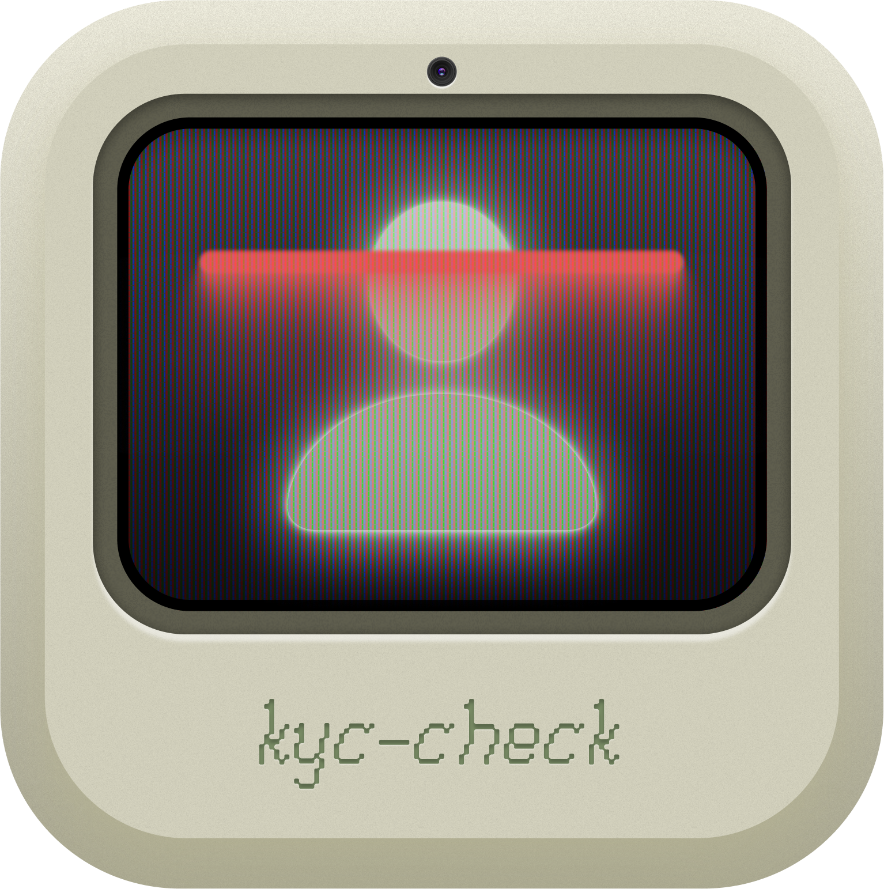

# KYC-CHECK 

A facial validation service for KYC (Know Your Customer) processes that compares two face images to determine if they belong to the same person.

You can use documents such as a driver's license to verify if it matches the photo.

## 📋 Table of Contents
- [KYC-CHECK ](#kyc-check-)
  - [📋 Table of Contents](#-table-of-contents)
  - [✨ Features](#-features)
  - [📚 Articles](#-articles)
  - [🏗️ Architecture](#️-architecture)
  - [🚀 Installation](#-installation)
  - [⚙️ Environment Setup](#️-environment-setup)
  - [💻 Usage](#-usage)
  - [🎨 Tailwind CSS](#-tailwind-css)
    - [Custom Tailwind Components](#custom-tailwind-components)
  - [📡 API Reference](#-api-reference)
    - [Face Validation Endpoint](#face-validation-endpoint)
      - [Request Parameters](#request-parameters)
      - [Response Structure](#response-structure)
      - [Example Response](#example-response)
    - [API Usage Examples](#api-usage-examples)
  - [🌍 Internationalization](#-internationalization)
    - [User Interface Language](#user-interface-language)
    - [API Language Support](#api-language-support)
  - [📁 Project Structure](#-project-structure)
  - [🚢 Deployment](#-deployment)
    - [Docker](#docker)
    - [Kubernetes](#kubernetes)
  - [🙏 Credits](#-credits)
  - [🤝 Contributing](#-contributing)

## ✨ Features

- ✅ Upload two images containing faces
- ✅ Real-time image preview
- ✅ Face similarity comparison
- ✅ Percentage-based similarity score
- ✅ Modern user interface with theme switching
- ✅ REST API for integration with other systems
- ✅ Internationalization (Portuguese & English)
- ✅ Monorepo architecture with separate packages
- ✅ Next.js frontend with TypeScript
- ✅ Docker and Kubernetes support

## 📚 Articles

- [Basic KYC Implementation Guide using KYC_CHECK](https://dev.to/juninhopo/basic-kyc-implementation-guide-using-kyccheck-3fld) - A practical guide on how to implement and use the KYC_CHECK library in your projects.

## 🏗️ Architecture

KYC-CHECK is structured as a monorepo using pnpm workspaces, consisting of two main packages:

- **API**: Backend service for face detection and comparison
- **Web**: Next.js frontend application with TypeScript and Tailwind CSS

This architecture allows independent development and deployment of each package while maintaining a unified codebase.

## 🚀 Installation

```bash
# Clone the repository
git clone https://github.com/juninhopo/kyc-check.git
cd kyc-check

# Install dependencies
pnpm install

# Download face recognition models
pnpm run download-models
```

## ⚙️ Environment Setup

Create a `.env` file in the root directory with the following variables:

```
PORT=3000
API_THRESHOLD=0.50
```

## 💻 Usage

```bash
# Start development environment for both packages
pnpm dev

# Start only the API development server
pnpm --filter api dev

# Start only the Web development server
pnpm --filter web dev

# Build for production
pnpm build

# Start production server
pnpm start
```

Access the application at `http://localhost:3000`

## 🎨 Tailwind CSS

This project uses Tailwind CSS for styling. Here are the available commands for working with Tailwind CSS:

```bash
# Build Tailwind CSS once
pnpm --filter web build:css

# Watch for changes and rebuild Tailwind CSS automatically
pnpm --filter web watch:css

# Start development server with Tailwind CSS watching
pnpm --filter web dev
```

### Custom Tailwind Components

The project includes several custom Tailwind components:

- `.btn` - Base button style
- `.btn-primary` - Primary action button
- `.btn-secondary` - Secondary action button
- `.card` / `.card-dark` - Card containers for light/dark modes
- `.lang-button` - Language selection buttons
- `.language-active` - Active language indicator
- `.theme-toggle` - Theme toggle button

You can find and modify these styles in the web package.

## 📡 API Reference

### Face Validation Endpoint

```
POST /api/validate-faces
```

#### Request Parameters

| Parameter | Types | Description |
|-----------|------|-------------|
| image1 | File | First face image |
| image2 | File | Second face image |

#### Response Structure

```typescript
type ValidationResponse = {
  success: boolean;
  data?: {
    isMatch: boolean;
    similarity: number;
    debugInfo?: {
      // Debug information about face detection
    };
  };
  error?: string;
};
```

#### Example Response

**Success Response:**
```json
{
  "success": true,
  "data": {
    "isMatch": true,
    "similarity": 0.92,
    "debugInfo": {
      "face1": {
        "confidence": 0.99,
        "detectionTime": 156
      },
      "face2": {
        "confidence": 0.98,
        "detectionTime": 142
      },
      "comparisonTime": 85
    }
  }
}
```

### API Usage Examples

**Using cURL:**
```bash
# Production
curl -X POST \
  https://kyc-check-production.up.railway.app/api/validate-faces \
  -H 'Content-Type: multipart/form-data' \
  -F 'image1=@/path/to/first/image.jpg' \
  -F 'image2=@/path/to/second/image.jpg'

# Local Development
curl -X POST \
  http://localhost:3000/api/validate-faces \
  -H 'Content-Type: multipart/form-data' \
  -F 'image1=@/path/to/first/image.jpg' \
  -F 'image2=@/path/to/second/image.jpg'
```

## 🌍 Internationalization

KYC-CHECK supports both Portuguese (Brazil) and English (US) languages:

### User Interface Language

Users can switch between languages by clicking on the language buttons (flags) located in the header:
- 🇧🇷 Portuguese (Brazil) - Default language
- 🇺🇸 English (US)

All interface elements, validation messages, and results will automatically be translated based on the selected language.

### API Language Support

When using the API, you can specify the preferred language for error messages:

```bash
curl -X POST \
  http://localhost:3000/api/validate-faces \
  -H 'Content-Type: multipart/form-data' \
  -H 'Accept-Language: en-US' \
  -F 'image1=@/path/to/first/image.jpg' \
  -F 'image2=@/path/to/second/image.jpg'
```

For Portuguese responses, use `Accept-Language: pt-BR`. If not specified, the API will default to Portuguese.

## 📁 Project Structure

```
kyc-check/
├── packages/
│   ├── api/              # Backend service
│   │   ├── models/       # Face recognition models
│   │   └── src/          # API source code
│   │       ├── api/      # API endpoints
│   │       ├── services/ # Face detection services
│   │       ├── types/    # TypeScript definitions
│   │       └── utils/    # Utility functions
│   └── web/              # Next.js Frontend
│       ├── public/       # Static assets
│       └── src/          # Frontend source code
│           ├── app/      # Next.js app directory
│           ├── components/  # React components
│           ├── contexts/ # React contexts
│           └── services/ # API service calls
├── k8s/                  # Kubernetes configurations
├── Dockerfile            # Docker configuration
├── pnpm-workspace.yaml   # pnpm workspace configuration
└── package.json          # Project root dependencies
```

## 🚢 Deployment

### Docker

Build and run the application using Docker:

```bash
# Build the Docker image
docker build -t kyc-check .

# Run the container
docker run -p 3000:3000 kyc-check
```

### Kubernetes

Deploy to a Kubernetes cluster using the provided configuration files:

```bash
kubectl apply -f k8s/deployment.yaml
kubectl apply -f k8s/service.yaml
```

## 🙏 Credits

- Icon designed by [Eric Viana](https://github.com/ericviana)
- This project is based on the original [KYC-CHECK](https://github.com/juninhopo/kyc-check) by [juninhopo](https://github.com/juninhopo)
- Special thanks to the developers of [face-api.js](https://github.com/justadudewhohacks/face-api.js) and its Node.js port by [@vladmandic](https://github.com/vladmandic/face-api)
- Interface redesigned with Next.js and TailwindCSS for improved usability and performance

## 🤝 Contributing

1. Fork the repository
2. Create your feature branch (`git checkout -b feature/amazing-feature`)
3. Commit your changes (`git commit -m 'Add some amazing feature'`)
4. Push to the branch (`git push origin feature/amazing-feature`)
5. Open a Pull Request


## Railway deployment note
This deployment copy uses Next.js 15.5.24 and intentionally regenerates `pnpm-lock.yaml` during the Docker build so Railway does not consume the original vulnerable Next.js 15.3.2 lockfile. The Dockerfile uses `pnpm install` before building.


### Railway fix
A package-level `packages/api/tsconfig.json` was added so the API download-models script resolves Node built-in types (`fs`, `path`, `https`, `process`, `__dirname`) correctly during the Docker build. The API already includes `@types/node`.
